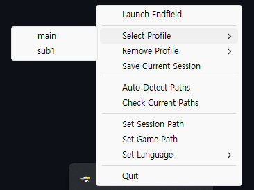

# TA-TA Switch

[English](../README.md) | **한국어**



[다운로드](https://github.com/kimcatchy/TA-TA-Switch/releases/download/v1.0.0/TA-TA-Switch.exe)

"명일방주: 엔드필드 (글로벌)" 플레이어들을 위한 계정 관리 프로그램입니다. 이 프로그램은 로컬에 저장된 세션 캐시 파일을 교체하여 단 한 번의 클릭으로 여러 계정을 전환할 수 있도록 설계되었으며, 메모리 점유율 10MB 미만 및 백그라운드 CPU 사용량 0을 지향합니다.

⚠️ **주의: 이 프로그램은 [자체 런처](https://endfield.gryphline.com/) 및 에픽게임즈 스토어를 통해 설치된 "명일방주: 엔드필드"와 호환됩니다. 구글 플레이 게임즈를 통한 설치는 현재 지원하지 않습니다.**

## ✨ 주요 기능

- **프로필 전환**: 세션 파일을 교체하여 여러 계정 간에 즉시 전환할 수 있습니다.
- **효율적인 메모리 및 네이티브 UI**: 메뉴와 대화 상자에 네이티브 Windows Win32 API를 사용하며, RAM 사용량을 10MB 미만으로 유지하도록 최적화되었습니다.
- **자동 감지**: 게임 설치 경로와 세션 폴더를 자동으로 찾습니다. (자체 런처 우선 탐지)
- **안전한 백업**: 계정 세션 데이터를 독립적인 저장소에 안전하게 보관합니다.
- **관리자 권한 승격**: 세션 파일 수정을 위해 자동으로 관리자 권한을 요청합니다.
- **다국어 지원**: 한국어와 영어를 완벽하게 지원합니다.

## 📂 데이터 저장 및 백업
설정 및 백업 데이터는 실행 파일 디렉토리가 아닌 사용자의 **문서** 폴더에 저장됩니다. 이를 통해 실행 파일을 이동하거나 삭제하더라도 데이터를 안전하게 유지할 수 있습니다.

- **경로**: `%USERPROFILE%\Documents\TA-TA\switch`
- **구성 요소**:
  - `settings.ini`: 앱 설정 및 언어 기본 설정.
  - `backups/`: 각 계정의 독립적인 세션 데이터가 포함된 폴더.

## 🚀 사용 방법

1. **실행**: `TA-TA-Switch.exe`를 실행합니다.
2. **자동 감지**: 트레이 아이콘을 클릭하고 **경로 자동 탐지**를 선택합니다. 자체 런처를 통해 설치된 경우를 우선적으로 탐지하며, 찾을 수 없는 경우 에픽 게임즈 설치 경로를 확인합니다.
3. **세션 저장**: 게임 내에서 계정에 로그인한 후, 트레이에서 **현재 세션 저장**을 선택하여 프로필 이름을 지정하고 저장합니다.
4. **전환**: 게임을 종료하고 **프로필 선택** 메뉴에서 프로필을 선택합니다.
5. **게임 실행**: **엔드필드 실행**을 클릭하여 선택한 프로필로 게임을 시작합니다.

## 🛠️ 소스에서 빌드하기

### 필수 조건
- [Rust](https://rustup.rs/) (Stable 채널)

### 단계
1. 저장소 복제:
   ```bash
   git clone https://github.com/kimcatchy/TA-TA-Switch.git
   cd TA-TA-Switch
   ```
2. 릴리스 모드로 빌드:
   ```bash
   cargo build --release
   ```
3. 실행 파일은 `target/release/TA-TA-Switch.exe`에 생성됩니다.

## 🛠️ 기술적 세부 사항

- **언어**: Rust 2021
- **UI 프레임워크**: [Native Windows GUI (NWG)](https://github.com/gabdube/native-windows-gui)
- **트레이 구현**: [tray-icon](https://github.com/tauri-apps/tray-icon)
- **리소스 관리**: 아이콘과 로케일 파일은 컴파일 시 바이너리에 직접 포함됩니다.

## ⚠️ 면책 조항
- 이 도구는 게임 클라이언트를 수정하지 않으며 로컬 캐시 파일만 관리합니다. 사용은 사용자의 책임입니다.
- 이 도구는 Hypergryph, Arknights: Endfield 또는 Epic Games Store와 제휴, 보증 또는 공식적으로 지원되지 않습니다.
